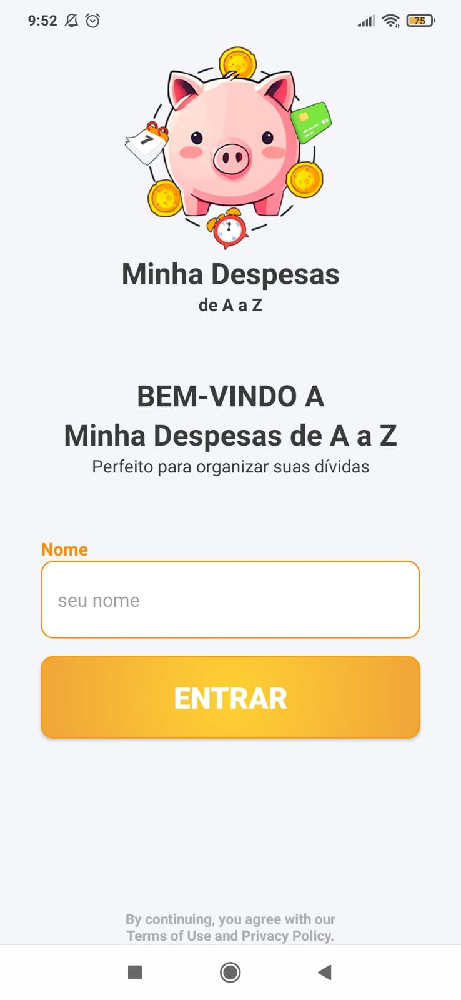
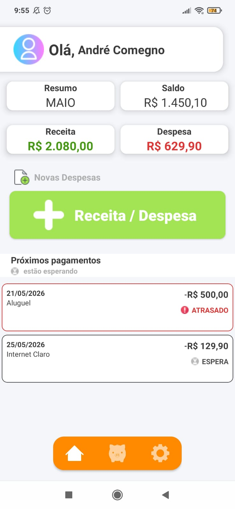
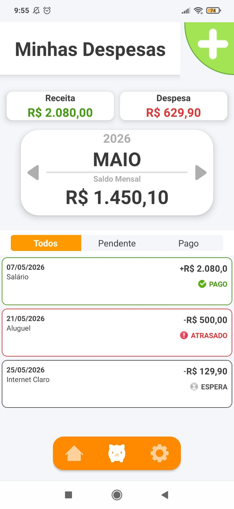
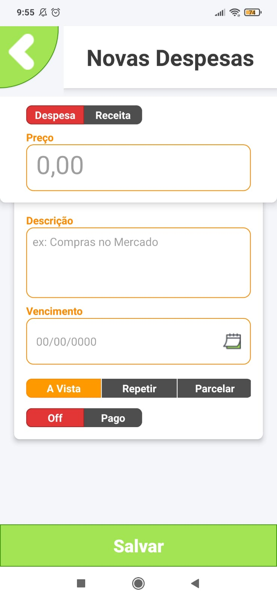
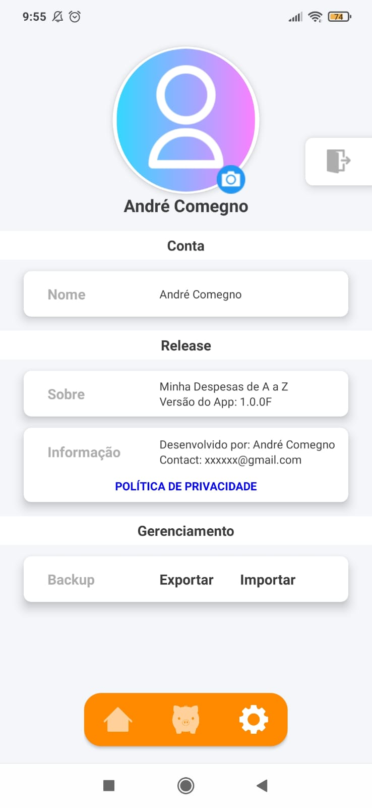

  <a href="https://opensource.org/licenses/MIT">
       
                                                                                   
  </a>

 #
 
# Introdução
O Minhas Despesas é um aplicativo nativo para Android que oferece uma interface intuitiva e fluida para 
você organizar seus gastos diários, planejar suas economias e manter suas contas em dia.

## Características
O aplicativo foi desenvolvido utilizando a linguagem Kotlin e conta com o banco de dados Room, garantindo
que suas informações sejam armazenadas de forma segura e eficiente diretamente no dispositivo.

Nota: O Minhas Despesas ainda está em fase de desenvolvimento. Você pode conferir algumas capturas de tela abaixo para conhecer a interface:

## Screenshots

 
     
        
     
        
       
    

 
### 👾 Linguagens e Ferramentas

 

#

